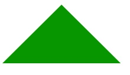
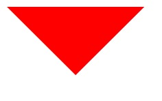
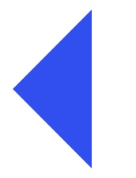
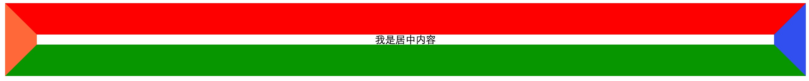
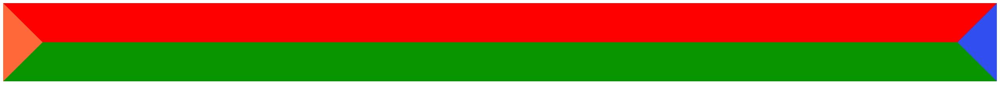
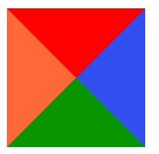
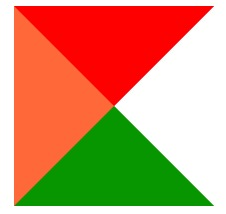
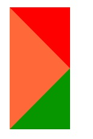
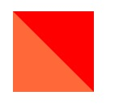

### 代码

#### 箭头向上:

```css
.test-border {
  width: 0;
  height: 0;
  border-bottom: 50px solid #00a000;
  border-left: 50px solid transparent;
  border-right: 50px solid transparent;
}
```



#### 箭头向下:

```css
.test-border {
  width: 0;
  height: 0;
  border-top: 50px solid #ff0000;
  border-left: 50px solid transparent;
  border-right: 50px solid transparent;
}
```



#### 箭头向左:

```css
.test-border {
  width: 0;
  height: 0;
  border-top: 50px solid transparent;
  border-bottom: 50px solid transparent;
  border-right: 50px solid #436eee;
}
```



#### 箭头向右:

```css
.test-border {
  width: 0;
  height: 0;
  border-top: 50px solid transparent;
  border-bottom: 50px solid transparent;
  border-left: 50px solid #ff7f50;
}
```


### 原理

### border 边框语法

- border 四条边框设置
- border-left 设置左边框，一般单独设置左边框样式使用
- border-right 设置右边框，一般单独设置右边框样式使用
- border-top 设置上边框，一般单独设置上边框样式使用
- border-bottom 设置下边框，一般单独设置下边框样式使用,有时可将下边框样式作为 CSS 下划线效果应用

基本用法

```css
// 为引用 class="border-four" 的盒子对象设置1px像素红色实线边框
.border-four {
  border: 1px solid #ff0000;
}

//  同理，单独给左边框设置1px像素红色实线边框
.border-left {
  border-left: 1px solid #ff0000;
}

//  同理，单独给右边框设置1px像素红色实线边框
.border-right {
  border-right: 1px solid #ff0000;
}

//  同理，单独给上边框设置1px像素红色实线边框
.border-top {
  border-top: 1px solid #ff0000;
}

//  同理，单独给底边框设置1px像素红色实线边框
.border-bottom {
  border-bottom: 1px solid #ff0000;
}
```

推荐常用边框

```css
// 实线边框：solid
.solid {
  border: 1px solid #ff0000;
}

// 虚线边框：dashed
.dashed {
  border: 1px dashed #ff0000;
}
```

### 进入正题：

首先来看一下正常块元素设置四条不同颜色边框效果：为了效果明显，所有边框宽度均为 50px；


代码如下:

```html
<div class="test-border">我是居中内容</div>
```

```css
.test-border {
  border-top: 50px solid #ff0000;
  border-bottom: 50px solid #00a000;
  border-left: 50px solid #ff7f50;
  border-right: 50px solid #436eee;
  text-align: center;
}
```

请各位记住四条边边框位置范围，这很重要。

接下来请在自己的大脑里面想象一下，当我去掉内容，效果显示会是什么样的？

再附上 html 代码，css 代码同上没有任何变化

```html
<div class="test-border"></div>
```

效果如下：



是不是和你想的不一样？因为此处 div 是块级元素，所以　会撑满一行。接下来我们会将宽和高设置为 0，看看效果又是什么样的呢？附上 html 和 css 代码以及效果图：

```html
<div class="test-border"></div>
```

```css
.test-border {
  width: 0;
  height: 0;
  border-top: 50px solid #ff0000;
  border-bottom: 50px solid #00a000;
  border-left: 50px solid #ff7f50;
  border-right: 50px solid #436eee;
  text-align: center;
}
```



我相信，看到上面效果图，距离我们实现三角形四个方向带箭头已经不远了，

如果我们将上图的下边框颜色设置为透明，即 border-right: 50px solid transparent;

效果如下：



如果我们我们去掉 border-right ，效果相信大家都能猜到，CSS 和 如下图所示：

```css
.test-border {
  width: 0;
  height: 0;
  border-top: 50px solid #ff0000;
  border-bottom: 50px solid #00a000;
  border-left: 50px solid #ff7f50;
}
```

备注：由于此时宽和高都设置为 0，所以 text-align: center 是多余的，去掉。



没错，就是这样的，和上面的透明的效果对比一下。

是不是离我们的三角箭头又更近一步了？此时有的人或许会想，我把上边框和下边框一起去掉不就是向右的三角箭头了？错，错，错，重要事情说三遍。当我们去掉上边框和下边框，此时盒子模型的高度是为 0，无法将左边框撑高，我们将看不到任何东西，所以，不能将上边框和下边框宽度设置为 0 或者去掉。

当然，有的机智的小伙伴会说那我将上边框或者下边框去掉会怎么样？让我们去掉下边框试一试吧。CSS 和 效果如下所示：

```css
.test-border {
  width: 0;
  height: 0;
  border-top: 50px solid #ff0000;
  border-left: 50px solid #ff7f50;
}
```



没错，效果就是这样，变成正方形了，等等我们是不是走错路了，现在的效果是不是我们的三角箭头原来越远了？那我们继续没有去掉 border-bottom 上来展开思考，

怎么样才能达到我们想要的效果呢？既不能去掉上边框也不能去掉下边框，我们可不可以隐藏上边框和下边框呢？秘密就在这儿。大家都知道 css 颜色有一个属性值 transparent

如果我们将上边框和下边框的颜色设置成透明会怎么样？自己在慢慢想象一下，效果如下：

```css
.test-border {
  width: 0;
  height: 0;
  border-top: 50px solid transparent;
  border-bottom: 50px solid transparent;
  border-left: 50px solid #ff7f50;
}
```


哇，这不就是传说中我们梦寐以求的向右的三角箭头么.

### 参考

[经典 CSS 实现三角形图标原理解析](https://www.cnblogs.com/jack-chan/p/5024129.html)
