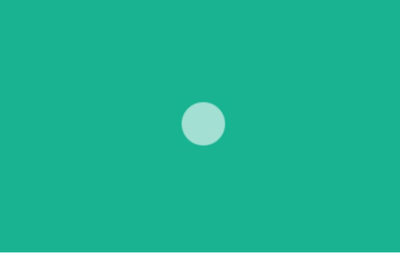

### 1


#### 解析
定义一个 div元素，设置边长为 40px 背景白色的正方形，然后设置循环翻转动画实现该加载效果动画

perspective 属性定义 3D 元素距视图的距离

#### html
```html
<div class="spinner"></div>
```
#### css
```scss
.spinner {
  width: 40px;
  height: 40px;
  background-color: #333;
  margin: 100px auto;
  -webkit-animation: sk-rotateplane 1.2s infinite ease-in-out;
  animation: sk-rotateplane 1.2s infinite ease-in-out;
}

@-webkit-keyframes sk-rotateplane {
  0% { -webkit-transform: perspective(120px) }
  50% { -webkit-transform: perspective(120px) rotateY(180deg) }
  100% { -webkit-transform: perspective(120px) rotateY(180deg)  rotateX(180deg) }
}

@keyframes sk-rotateplane {
  0% { 
    transform: perspective(120px) rotateX(0deg) rotateY(0deg);
    -webkit-transform: perspective(120px) rotateX(0deg) rotateY(0deg) 
  } 50% { 
    transform: perspective(120px) rotateX(-180.1deg) rotateY(0deg);
    -webkit-transform: perspective(120px) rotateX(-180.1deg) rotateY(0deg) 
  } 100% { 
    transform: perspective(120px) rotateX(-180deg) rotateY(-179.9deg);
    -webkit-transform: perspective(120px) rotateX(-180deg) rotateY(-179.9deg);
  }
}
```

### 2


#### 解析
定义一个父元素 div，内含六个白色实心圆点，添加旋转动画，通过设置不同的延迟时间来达到依次出现的效果

#### html
```html
<div class="sk-chase">
  <div class="sk-chase-dot"></div>
  <div class="sk-chase-dot"></div>
  <div class="sk-chase-dot"></div>
  <div class="sk-chase-dot"></div>
  <div class="sk-chase-dot"></div>
  <div class="sk-chase-dot"></div>
</div>
```

#### css
```css
.sk-chase {
  width: 40px;
  height: 40px;
  position: relative;
  animation: sk-chase 2.5s infinite linear both;
}
 
.sk-chase-dot {
  width: 100%;
  height: 100%;
  position: absolute;
  left: 0;
  top: 0; 
  animation: sk-chase-dot 2.0s infinite ease-in-out both; 
}
 
.sk-chase-dot:before {
  content: '';
  display: block;
  width: 25%;
  height: 25%;
  background-color: #fff;
  border-radius: 100%;
  animation: sk-chase-dot-before 2.0s infinite ease-in-out both; 
}
 
.sk-chase-dot:nth-child(1) { animation-delay: -1.1s; }
.sk-chase-dot:nth-child(2) { animation-delay: -1.0s; }
.sk-chase-dot:nth-child(3) { animation-delay: -0.9s; }
.sk-chase-dot:nth-child(4) { animation-delay: -0.8s; }
.sk-chase-dot:nth-child(5) { animation-delay: -0.7s; }
.sk-chase-dot:nth-child(6) { animation-delay: -0.6s; }
.sk-chase-dot:nth-child(1):before { animation-delay: -1.1s; }
.sk-chase-dot:nth-child(2):before { animation-delay: -1.0s; }
.sk-chase-dot:nth-child(3):before { animation-delay: -0.9s; }
.sk-chase-dot:nth-child(4):before { animation-delay: -0.8s; }
.sk-chase-dot:nth-child(5):before { animation-delay: -0.7s; }
.sk-chase-dot:nth-child(6):before { animation-delay: -0.6s; }
 
@keyframes sk-chase {
  100% { transform: rotate(360deg); } 
}
 
@keyframes sk-chase-dot {
  80%, 100% { transform: rotate(360deg); } 
}
 
@keyframes sk-chase-dot-before {
  50% {
    transform: scale(0.4); 
  } 100%, 0% {
    transform: scale(1.0); 
  } 
}
```

### 3


#### 解析
两个子元素 div 实现半透明的圆形，设置绝对定位重叠在一起，然后设置相同的动画通过不同的延迟时间交替放大缩小。

#### html
```html
<div class="spinner">
  <div class="double-bounce1"></div>
  <div class="double-bounce2"></div>
</div>
```

#### css
```css
.spinner {
  width: 40px;
  height: 40px;

  position: relative;
  margin: 100px auto;
}

.double-bounce1, .double-bounce2 {
  width: 100%;
  height: 100%;
  border-radius: 50%;
  background-color: #333;
  opacity: 0.6;
  position: absolute;
  top: 0;
  left: 0;
  
  -webkit-animation: sk-bounce 2.0s infinite ease-in-out;
  animation: sk-bounce 2.0s infinite ease-in-out;
}

.double-bounce2 {
  -webkit-animation-delay: -1.0s;
  animation-delay: -1.0s;
}

@-webkit-keyframes sk-bounce {
  0%, 100% { -webkit-transform: scale(0.0) }
  50% { -webkit-transform: scale(1.0) }
}

@keyframes sk-bounce {
  0%, 100% { 
    transform: scale(0.0);
    -webkit-transform: scale(0.0);
  } 50% { 
    transform: scale(1.0);
    -webkit-transform: scale(1.0);
  }
}
```

### 4


#### 解析
在类名为 spinner元素下有五个 div 实现的长方形元素，设置Y轴的缩放，通过不同的延迟时间来达到依次变化的效果。

#### html
```html
<div class="spinner">
  <div class="rect1"></div>
  <div class="rect2"></div>
  <div class="rect3"></div>
  <div class="rect4"></div>
  <div class="rect5"></div>
</div>
```

#### css
```css
.spinner {
  margin: 100px auto;
  width: 50px;
  height: 40px;
  text-align: center;
  font-size: 10px;
}

.spinner > div {
  background-color: #333;
  height: 100%;
  width: 6px;
  display: inline-block;
  
  -webkit-animation: sk-stretchdelay 1.2s infinite ease-in-out;
  animation: sk-stretchdelay 1.2s infinite ease-in-out;
}

.spinner .rect2 {
  -webkit-animation-delay: -1.1s;
  animation-delay: -1.1s;
}

.spinner .rect3 {
  -webkit-animation-delay: -1.0s;
  animation-delay: -1.0s;
}

.spinner .rect4 {
  -webkit-animation-delay: -0.9s;
  animation-delay: -0.9s;
}

.spinner .rect5 {
  -webkit-animation-delay: -0.8s;
  animation-delay: -0.8s;
}

@-webkit-keyframes sk-stretchdelay {
  0%, 40%, 100% { -webkit-transform: scaleY(0.4) }  
  20% { -webkit-transform: scaleY(1.0) }
}

@keyframes sk-stretchdelay {
  0%, 40%, 100% { 
    transform: scaleY(0.4);
    -webkit-transform: scaleY(0.4);
  }  20% { 
    transform: scaleY(1.0);
    -webkit-transform: scaleY(1.0);
  }
}
```

### 5


#### 解析
两个子元素实现白色的方块，添加动画属性，在X轴和Y轴分别设置移动距离和缩放，通过不同的延迟时间来分离他们，rorate实现围绕中心旋转。

#### html
```html
<div class="spinner">
  <div class="cube1"></div>
  <div class="cube2"></div>
</div>
```
#### css
```css
.cube1, .cube2 {
  background-color: #333;
  width: 15px;
  height: 15px;
  position: absolute;
  top: 0;
  left: 0;
  
  -webkit-animation: sk-cubemove 1.8s infinite ease-in-out;
  animation: sk-cubemove 1.8s infinite ease-in-out;
}

.cube2 {
  -webkit-animation-delay: -0.9s;
  animation-delay: -0.9s;
}

@-webkit-keyframes sk-cubemove {
  25% { -webkit-transform: translateX(42px) rotate(-90deg) scale(0.5) }
  50% { -webkit-transform: translateX(42px) translateY(42px) rotate(-180deg) }
  75% { -webkit-transform: translateX(0px) translateY(42px) rotate(-270deg) scale(0.5) }
  100% { -webkit-transform: rotate(-360deg) }
}

@keyframes sk-cubemove {
  25% { 
    transform: translateX(42px) rotate(-90deg) scale(0.5);
    -webkit-transform: translateX(42px) rotate(-90deg) scale(0.5);
  } 50% { 
    transform: translateX(42px) translateY(42px) rotate(-179deg);
    -webkit-transform: translateX(42px) translateY(42px) rotate(-179deg);
  } 50.1% { 
    transform: translateX(42px) translateY(42px) rotate(-180deg);
    -webkit-transform: translateX(42px) translateY(42px) rotate(-180deg);
  } 75% { 
    transform: translateX(0px) translateY(42px) rotate(-270deg) scale(0.5);
    -webkit-transform: translateX(0px) translateY(42px) rotate(-270deg) scale(0.5);
  } 100% { 
    transform: rotate(-360deg);
    -webkit-transform: rotate(-360deg);
  }
}
```

### 6


#### 解析
唯一的 div元素实现白色背景圆点，通过设置缩放和透明度实现呼吸灯的效果。

#### html
```html
<div class="spinner"></div>
```
#### css
```css
.spinner {
  width: 40px;
  height: 40px;
  margin: 100px auto;
  background-color: #333;

  border-radius: 100%;  
  -webkit-animation: sk-scaleout 1.0s infinite ease-in-out;
  animation: sk-scaleout 1.0s infinite ease-in-out;
}

@-webkit-keyframes sk-scaleout {
  0% { -webkit-transform: scale(0) }
  100% {
    -webkit-transform: scale(1.0);
    opacity: 0;
  }
}

@keyframes sk-scaleout {
  0% { 
    -webkit-transform: scale(0);
    transform: scale(0);
  } 100% {
    -webkit-transform: scale(1.0);
    transform: scale(1.0);
    opacity: 0;
  }
}
```

### 7


#### 解析
两个实心圆形围绕中心做循环的缩放旋转运动，因为不同的延迟时间来达到它们同一时间呈现相反的表现。
#### html
```html
<div class="spinner">
  <div class="dot1"></div>
  <div class="dot2"></div>
</div>
```
#### css
``` css
.spinner {
  margin: 100px auto;
  width: 40px;
  height: 40px;
  position: relative;
  text-align: center;
  
  -webkit-animation: sk-rotate 2.0s infinite linear;
  animation: sk-rotate 2.0s infinite linear;
}

.dot1, .dot2 {
  width: 60%;
  height: 60%;
  display: inline-block;
  position: absolute;
  top: 0;
  background-color: #333;
  border-radius: 100%;
  
  -webkit-animation: sk-bounce 2.0s infinite ease-in-out;
  animation: sk-bounce 2.0s infinite ease-in-out;
}

.dot2 {
  top: auto;
  bottom: 0;
  -webkit-animation-delay: -1.0s;
  animation-delay: -1.0s;
}

@-webkit-keyframes sk-rotate { 100% { -webkit-transform: rotate(360deg) }}
@keyframes sk-rotate { 100% { transform: rotate(360deg); -webkit-transform: rotate(360deg) }}

@-webkit-keyframes sk-bounce {
  0%, 100% { -webkit-transform: scale(0.0) }
  50% { -webkit-transform: scale(1.0) }
}

@keyframes sk-bounce {
  0%, 100% { 
    transform: scale(0.0);
    -webkit-transform: scale(0.0);
  } 50% { 
    transform: scale(1.0);
    -webkit-transform: scale(1.0);
  }
}
```

### 8


### 解析
三个实色圆形横向排列，线性动画 scale从0到1，通过给它们不同的延迟时间，呈现依次交替的效果。

### html
```html
<div class="spinner">
  <div class="bounce1"></div>
  <div class="bounce2"></div>
  <div class="bounce3"></div>
</div>
```

### css
```css
.spinner {
  margin: 100px auto 0;
  width: 70px;
  text-align: center;
}

.spinner > div {
  width: 18px;
  height: 18px;
  background-color: #333;

  border-radius: 100%;
  display: inline-block;
  -webkit-animation: sk-bouncedelay 1.4s infinite ease-in-out both;
  animation: sk-bouncedelay 1.4s infinite ease-in-out both;
}

.spinner .bounce1 {
  -webkit-animation-delay: -0.32s;
  animation-delay: -0.32s;
}

.spinner .bounce2 {
  -webkit-animation-delay: -0.16s;
  animation-delay: -0.16s;
}

@-webkit-keyframes sk-bouncedelay {
  0%, 80%, 100% { -webkit-transform: scale(0) }
  40% { -webkit-transform: scale(1.0) }
}

@keyframes sk-bouncedelay {
  0%, 80%, 100% { 
    -webkit-transform: scale(0);
    transform: scale(0);
  } 40% { 
    -webkit-transform: scale(1.0);
    transform: scale(1.0);
  }
}
```

### 9


#### 解析
整个加载效果由12个圆心组成，设置不同的旋转让它们呈现圆形环绕，然后设置不同的延迟时间，让它们做缩放运动。
#### html
```html
<div class="sk-circle">
  <div class="sk-circle1 sk-child"></div>
  <div class="sk-circle2 sk-child"></div>
  <div class="sk-circle3 sk-child"></div>
  <div class="sk-circle4 sk-child"></div>
  <div class="sk-circle5 sk-child"></div>
  <div class="sk-circle6 sk-child"></div>
  <div class="sk-circle7 sk-child"></div>
  <div class="sk-circle8 sk-child"></div>
  <div class="sk-circle9 sk-child"></div>
  <div class="sk-circle10 sk-child"></div>
  <div class="sk-circle11 sk-child"></div>
  <div class="sk-circle12 sk-child"></div>
</div>
```
#### css
```
.sk-circle {
  margin: 100px auto;
  width: 40px;
  height: 40px;
  position: relative;
}
.sk-circle .sk-child {
  width: 100%;
  height: 100%;
  position: absolute;
  left: 0;
  top: 0;
}
.sk-circle .sk-child:before {
  content: '';
  display: block;
  margin: 0 auto;
  width: 15%;
  height: 15%;
  background-color: #333;
  border-radius: 100%;
  -webkit-animation: sk-circleBounceDelay 1.2s infinite ease-in-out both;
          animation: sk-circleBounceDelay 1.2s infinite ease-in-out both;
}
.sk-circle .sk-circle2 {
  -webkit-transform: rotate(30deg);
      -ms-transform: rotate(30deg);
          transform: rotate(30deg); }
.sk-circle .sk-circle3 {
  -webkit-transform: rotate(60deg);
      -ms-transform: rotate(60deg);
          transform: rotate(60deg); }
.sk-circle .sk-circle4 {
  -webkit-transform: rotate(90deg);
      -ms-transform: rotate(90deg);
          transform: rotate(90deg); }
.sk-circle .sk-circle5 {
  -webkit-transform: rotate(120deg);
      -ms-transform: rotate(120deg);
          transform: rotate(120deg); }
.sk-circle .sk-circle6 {
  -webkit-transform: rotate(150deg);
      -ms-transform: rotate(150deg);
          transform: rotate(150deg); }
.sk-circle .sk-circle7 {
  -webkit-transform: rotate(180deg);
      -ms-transform: rotate(180deg);
          transform: rotate(180deg); }
.sk-circle .sk-circle8 {
  -webkit-transform: rotate(210deg);
      -ms-transform: rotate(210deg);
          transform: rotate(210deg); }
.sk-circle .sk-circle9 {
  -webkit-transform: rotate(240deg);
      -ms-transform: rotate(240deg);
          transform: rotate(240deg); }
.sk-circle .sk-circle10 {
  -webkit-transform: rotate(270deg);
      -ms-transform: rotate(270deg);
          transform: rotate(270deg); }
.sk-circle .sk-circle11 {
  -webkit-transform: rotate(300deg);
      -ms-transform: rotate(300deg);
          transform: rotate(300deg); }
.sk-circle .sk-circle12 {
  -webkit-transform: rotate(330deg);
      -ms-transform: rotate(330deg);
          transform: rotate(330deg); }
.sk-circle .sk-circle2:before {
  -webkit-animation-delay: -1.1s;
          animation-delay: -1.1s; }
.sk-circle .sk-circle3:before {
  -webkit-animation-delay: -1s;
          animation-delay: -1s; }
.sk-circle .sk-circle4:before {
  -webkit-animation-delay: -0.9s;
          animation-delay: -0.9s; }
.sk-circle .sk-circle5:before {
  -webkit-animation-delay: -0.8s;
          animation-delay: -0.8s; }
.sk-circle .sk-circle6:before {
  -webkit-animation-delay: -0.7s;
          animation-delay: -0.7s; }
.sk-circle .sk-circle7:before {
  -webkit-animation-delay: -0.6s;
          animation-delay: -0.6s; }
.sk-circle .sk-circle8:before {
  -webkit-animation-delay: -0.5s;
          animation-delay: -0.5s; }
.sk-circle .sk-circle9:before {
  -webkit-animation-delay: -0.4s;
          animation-delay: -0.4s; }
.sk-circle .sk-circle10:before {
  -webkit-animation-delay: -0.3s;
          animation-delay: -0.3s; }
.sk-circle .sk-circle11:before {
  -webkit-animation-delay: -0.2s;
          animation-delay: -0.2s; }
.sk-circle .sk-circle12:before {
  -webkit-animation-delay: -0.1s;
          animation-delay: -0.1s; }

@-webkit-keyframes sk-circleBounceDelay {
  0%, 80%, 100% {
    -webkit-transform: scale(0);
            transform: scale(0);
  } 40% {
    -webkit-transform: scale(1);
            transform: scale(1);
  }
}

@keyframes sk-circleBounceDelay {
  0%, 80%, 100% {
    -webkit-transform: scale(0);
            transform: scale(0);
  } 40% {
    -webkit-transform: scale(1);
            transform: scale(1);
  }
}
```

### 10


#### 解析
九个方块通过 grid布局，形成横向纵向分别三块，设置不同的延迟时间让它们做线性 3D 缩放运动。
#### html
```html
<div class="sk-cube-grid">
  <div class="sk-cube sk-cube1"></div>
  <div class="sk-cube sk-cube2"></div>
  <div class="sk-cube sk-cube3"></div>
  <div class="sk-cube sk-cube4"></div>
  <div class="sk-cube sk-cube5"></div>
  <div class="sk-cube sk-cube6"></div>
  <div class="sk-cube sk-cube7"></div>
  <div class="sk-cube sk-cube8"></div>
  <div class="sk-cube sk-cube9"></div>
</div>
```
#### css
```css
.sk-cube-grid {
  width: 40px;
  height: 40px;
  margin: 100px auto;
}

.sk-cube-grid .sk-cube {
  width: 33%;
  height: 33%;
  background-color: #333;
  float: left;
  -webkit-animation: sk-cubeGridScaleDelay 1.3s infinite ease-in-out;
          animation: sk-cubeGridScaleDelay 1.3s infinite ease-in-out; 
}
.sk-cube-grid .sk-cube1 {
  -webkit-animation-delay: 0.2s;
          animation-delay: 0.2s; }
.sk-cube-grid .sk-cube2 {
  -webkit-animation-delay: 0.3s;
          animation-delay: 0.3s; }
.sk-cube-grid .sk-cube3 {
  -webkit-animation-delay: 0.4s;
          animation-delay: 0.4s; }
.sk-cube-grid .sk-cube4 {
  -webkit-animation-delay: 0.1s;
          animation-delay: 0.1s; }
.sk-cube-grid .sk-cube5 {
  -webkit-animation-delay: 0.2s;
          animation-delay: 0.2s; }
.sk-cube-grid .sk-cube6 {
  -webkit-animation-delay: 0.3s;
          animation-delay: 0.3s; }
.sk-cube-grid .sk-cube7 {
  -webkit-animation-delay: 0s;
          animation-delay: 0s; }
.sk-cube-grid .sk-cube8 {
  -webkit-animation-delay: 0.1s;
          animation-delay: 0.1s; }
.sk-cube-grid .sk-cube9 {
  -webkit-animation-delay: 0.2s;
          animation-delay: 0.2s; }

@-webkit-keyframes sk-cubeGridScaleDelay {
  0%, 70%, 100% {
    -webkit-transform: scale3D(1, 1, 1);
            transform: scale3D(1, 1, 1);
  } 35% {
    -webkit-transform: scale3D(0, 0, 1);
            transform: scale3D(0, 0, 1); 
  }
}

@keyframes sk-cubeGridScaleDelay {
  0%, 70%, 100% {
    -webkit-transform: scale3D(1, 1, 1);
            transform: scale3D(1, 1, 1);
  } 35% {
    -webkit-transform: scale3D(0, 0, 1);
            transform: scale3D(0, 0, 1);
  } 
}
```

### 11

#### 解析
加载动画由12个实色圆点360度依次摆开，依次做旋转和透明度的改变。
#### html
```html
<div class="sk-fading-circle">
  <div class="sk-circle1 sk-circle"></div>
  <div class="sk-circle2 sk-circle"></div>
  <div class="sk-circle3 sk-circle"></div>
  <div class="sk-circle4 sk-circle"></div>
  <div class="sk-circle5 sk-circle"></div>
  <div class="sk-circle6 sk-circle"></div>
  <div class="sk-circle7 sk-circle"></div>
  <div class="sk-circle8 sk-circle"></div>
  <div class="sk-circle9 sk-circle"></div>
  <div class="sk-circle10 sk-circle"></div>
  <div class="sk-circle11 sk-circle"></div>
  <div class="sk-circle12 sk-circle"></div>
</div>
```
#### css
```css
.sk-fading-circle {
  margin: 100px auto;
  width: 40px;
  height: 40px;
  position: relative;
}

.sk-fading-circle .sk-circle {
  width: 100%;
  height: 100%;
  position: absolute;
  left: 0;
  top: 0;
}

.sk-fading-circle .sk-circle:before {
  content: '';
  display: block;
  margin: 0 auto;
  width: 15%;
  height: 15%;
  background-color: #333;
  border-radius: 100%;
  -webkit-animation: sk-circleFadeDelay 1.2s infinite ease-in-out both;
          animation: sk-circleFadeDelay 1.2s infinite ease-in-out both;
}
.sk-fading-circle .sk-circle2 {
  -webkit-transform: rotate(30deg);
      -ms-transform: rotate(30deg);
          transform: rotate(30deg);
}
.sk-fading-circle .sk-circle3 {
  -webkit-transform: rotate(60deg);
      -ms-transform: rotate(60deg);
          transform: rotate(60deg);
}
.sk-fading-circle .sk-circle4 {
  -webkit-transform: rotate(90deg);
      -ms-transform: rotate(90deg);
          transform: rotate(90deg);
}
.sk-fading-circle .sk-circle5 {
  -webkit-transform: rotate(120deg);
      -ms-transform: rotate(120deg);
          transform: rotate(120deg);
}
.sk-fading-circle .sk-circle6 {
  -webkit-transform: rotate(150deg);
      -ms-transform: rotate(150deg);
          transform: rotate(150deg);
}
.sk-fading-circle .sk-circle7 {
  -webkit-transform: rotate(180deg);
      -ms-transform: rotate(180deg);
          transform: rotate(180deg);
}
.sk-fading-circle .sk-circle8 {
  -webkit-transform: rotate(210deg);
      -ms-transform: rotate(210deg);
          transform: rotate(210deg);
}
.sk-fading-circle .sk-circle9 {
  -webkit-transform: rotate(240deg);
      -ms-transform: rotate(240deg);
          transform: rotate(240deg);
}
.sk-fading-circle .sk-circle10 {
  -webkit-transform: rotate(270deg);
      -ms-transform: rotate(270deg);
          transform: rotate(270deg);
}
.sk-fading-circle .sk-circle11 {
  -webkit-transform: rotate(300deg);
      -ms-transform: rotate(300deg);
          transform: rotate(300deg); 
}
.sk-fading-circle .sk-circle12 {
  -webkit-transform: rotate(330deg);
      -ms-transform: rotate(330deg);
          transform: rotate(330deg); 
}
.sk-fading-circle .sk-circle2:before {
  -webkit-animation-delay: -1.1s;
          animation-delay: -1.1s; 
}
.sk-fading-circle .sk-circle3:before {
  -webkit-animation-delay: -1s;
          animation-delay: -1s; 
}
.sk-fading-circle .sk-circle4:before {
  -webkit-animation-delay: -0.9s;
          animation-delay: -0.9s; 
}
.sk-fading-circle .sk-circle5:before {
  -webkit-animation-delay: -0.8s;
          animation-delay: -0.8s; 
}
.sk-fading-circle .sk-circle6:before {
  -webkit-animation-delay: -0.7s;
          animation-delay: -0.7s; 
}
.sk-fading-circle .sk-circle7:before {
  -webkit-animation-delay: -0.6s;
          animation-delay: -0.6s; 
}
.sk-fading-circle .sk-circle8:before {
  -webkit-animation-delay: -0.5s;
          animation-delay: -0.5s; 
}
.sk-fading-circle .sk-circle9:before {
  -webkit-animation-delay: -0.4s;
          animation-delay: -0.4s;
}
.sk-fading-circle .sk-circle10:before {
  -webkit-animation-delay: -0.3s;
          animation-delay: -0.3s;
}
.sk-fading-circle .sk-circle11:before {
  -webkit-animation-delay: -0.2s;
          animation-delay: -0.2s;
}
.sk-fading-circle .sk-circle12:before {
  -webkit-animation-delay: -0.1s;
          animation-delay: -0.1s;
}

@-webkit-keyframes sk-circleFadeDelay {
  0%, 39%, 100% { opacity: 0; }
  40% { opacity: 1; }
}

@keyframes sk-circleFadeDelay {
  0%, 39%, 100% { opacity: 0; }
  40% { opacity: 1; } 
}
```

### 12

#### 解析
四个等边方块形成一个正方形，整个旋转45度，然后每个方块通过不同的延迟时间，沿X轴做翻转动画。设置perspective是为了有3D的效果。
#### html
```html
<div class="sk-folding-cube">
  <div class="sk-cube1 sk-cube"></div>
  <div class="sk-cube2 sk-cube"></div>
  <div class="sk-cube4 sk-cube"></div>
  <div class="sk-cube3 sk-cube"></div>
</div>
```
#### css
```css
.sk-folding-cube {
  margin: 20px auto;
  width: 40px;
  height: 40px;
  position: relative;
  -webkit-transform: rotateZ(45deg);
          transform: rotateZ(45deg);
}

.sk-folding-cube .sk-cube {
  float: left;
  width: 50%;
  height: 50%;
  position: relative;
  -webkit-transform: scale(1.1);
      -ms-transform: scale(1.1);
          transform: scale(1.1); 
}
.sk-folding-cube .sk-cube:before {
  content: '';
  position: absolute;
  top: 0;
  left: 0;
  width: 100%;
  height: 100%;
  background-color: #333;
  -webkit-animation: sk-foldCubeAngle 2.4s infinite linear both;
          animation: sk-foldCubeAngle 2.4s infinite linear both;
  -webkit-transform-origin: 100% 100%;
      -ms-transform-origin: 100% 100%;
          transform-origin: 100% 100%;
}
.sk-folding-cube .sk-cube2 {
  -webkit-transform: scale(1.1) rotateZ(90deg);
          transform: scale(1.1) rotateZ(90deg);
}
.sk-folding-cube .sk-cube3 {
  -webkit-transform: scale(1.1) rotateZ(180deg);
          transform: scale(1.1) rotateZ(180deg);
}
.sk-folding-cube .sk-cube4 {
  -webkit-transform: scale(1.1) rotateZ(270deg);
          transform: scale(1.1) rotateZ(270deg);
}
.sk-folding-cube .sk-cube2:before {
  -webkit-animation-delay: 0.3s;
          animation-delay: 0.3s;
}
.sk-folding-cube .sk-cube3:before {
  -webkit-animation-delay: 0.6s;
          animation-delay: 0.6s; 
}
.sk-folding-cube .sk-cube4:before {
  -webkit-animation-delay: 0.9s;
          animation-delay: 0.9s;
}
@-webkit-keyframes sk-foldCubeAngle {
  0%, 10% {
    -webkit-transform: perspective(140px) rotateX(-180deg);
            transform: perspective(140px) rotateX(-180deg);
    opacity: 0; 
  } 25%, 75% {
    -webkit-transform: perspective(140px) rotateX(0deg);
            transform: perspective(140px) rotateX(0deg);
    opacity: 1; 
  } 90%, 100% {
    -webkit-transform: perspective(140px) rotateY(180deg);
            transform: perspective(140px) rotateY(180deg);
    opacity: 0; 
  } 
}

@keyframes sk-foldCubeAngle {
  0%, 10% {
    -webkit-transform: perspective(140px) rotateX(-180deg);
            transform: perspective(140px) rotateX(-180deg);
    opacity: 0; 
  } 25%, 75% {
    -webkit-transform: perspective(140px) rotateX(0deg);
            transform: perspective(140px) rotateX(0deg);
    opacity: 1; 
  } 90%, 100% {
    -webkit-transform: perspective(140px) rotateY(180deg);
            transform: perspective(140px) rotateY(180deg);
    opacity: 0; 
  }
}
```

### 结论
以上的这些案例原理都是通过不同的延迟时间，给元素或子元素设置包括X、Y和Z轴上的移动旋转，以及缩放来达到动画的效果。有了这些参考，加上创意还能做出更多的类型加载效果。

### 参考
[CSS 实现各种 Loading 效果附带解析过程](https://www.jb51.net/css/764447.html)


