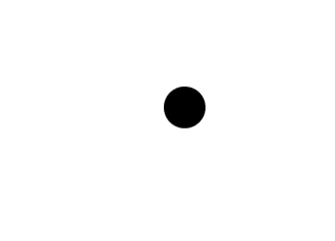

### 简介


### 代码
```Vue
    <div v-drag class="drag">
    </div>
```

```js
<script>
  export default {
    data () {
      return {
      };
    },

    directives: {
      drag: {
        // 指令的定义
        bind: function (el) {
          let oDiv = el; // 获取当前元素
          let disX, disY;
          oDiv.addEventListener("touchstart", function (e) {
            disX = e.touches[0].clientX - oDiv.offsetLeft;
            disY = e.touches[0].clientY - oDiv.offsetTop;
          });
          oDiv.addEventListener("touchmove", function (e) {
            let app = document.getElementById("app");
            app.style.height = "100vh";
            app.style.overflow = "hidden";
            let left = e.touches[0].clientX - disX;
            let top = e.touches[0].clientY - disY;
            oDiv.style.left = left + "px";
            oDiv.style.top = top + "px";
          });
          oDiv.addEventListener("touchend", function (e) {
            let app = document.getElementById("app");
            app.style.removeProperty("height");
            app.style.removeProperty("overflow");
          });
        },
      },
    },
  };
</script>
```

```vue
<style lang="scss" scoped>
  .drag {
    position: fixed;
    right: 10px;
    top: 100px;
    border-radius: 50%;
    width: 50px;
    height: 50px;
    line-height: 50px;
    background-color: #000;
    color: #fff;
  }
</style>
```