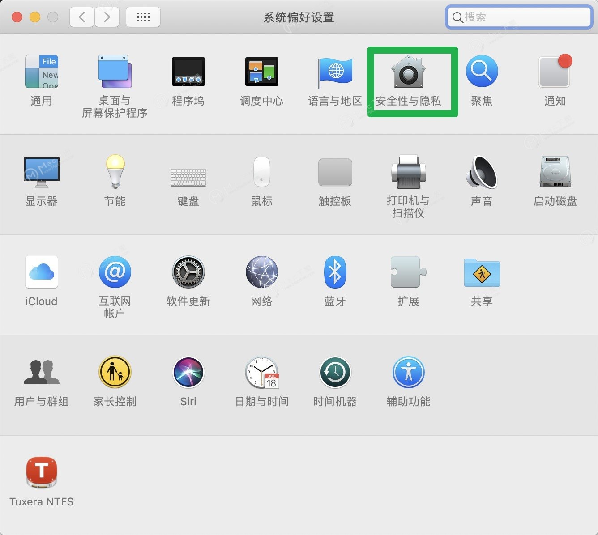
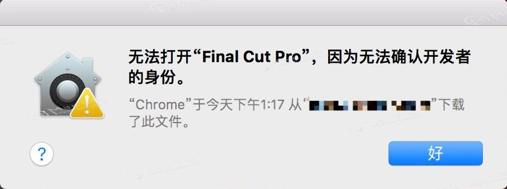

### Mac应用程序无法打开或文件损坏的处理方法

很多用户在安装Mac软件的时候，经常会遇到提示“xxx.app已损坏，打不开。您应该将它移到废纸篓“或”打不开的xxx.app，因为它来自身份不明的开发者”，如下图的样子：

真的损坏了么？是不是真的要移动到废纸篓呢？遇到这样的情况，通常是打开任何来源即可轻松解决，一起看下。

1. 打开系统偏好设置界面，进入安全性与隐私，如下图所示：

2. 点按左下角的锁头图标，解锁更改权限

3. 将允许从以下位置下载的应用，更改为 “ 任何来源 ” ，然后再打开应用即可

有朋友就说了，我这直接打开没有显示任何来源这一项怎么办？小编这就说下Mac没有任何来源选项怎么打开任何来源

**若没有“任何来源”这个选项，按以下步骤执行：**

1、打开终端（Terminal.app）

2、拷贝粘贴 sudo spctl --master-disable 按回车键

3、输入你的账户密码，按回车键确认执行（输入密码不会显示，直接输入确定正确即可）

怎么打开终端？

1、系统偏好设置--其他打开终端

需要注意的是：拷贝粘贴 sudo spctl --master-disable的时候注意不要有多余的空格，输入密码的时候不会显示密码，别以为没输上呢，只要你输入对了回车就可以了。输入后到”隐私性与安全“那里看下，任何来源已经选中并已打开，这个时候不需要再解锁选中等其他操作。

如已经开启任何来源，但依旧打不开（macOS Catalina  10.15以上会遇到）按以下步骤执行：

绕开公证：

复制指令【sudo xattr -r -d com.apple.quarantine 】后面有个空格不要丢了，将损坏的文件拖动到指令后面，回车，输入电脑密码回车即可

上述修复指令输入完成，打开软件还是提示损坏，再进行下面的步骤：

修复签名：

复制指令【sudo codesign --sign - --force --deep 】后面有个空格不要丢了，将损坏的文件拖动到指令后面，回车，输入电脑密码回车即可

再次 右键打开 软件应该可以解决这个问题了。

还有一种情况，如安装应用时，出现 “ 打不开 XXX.app，因为它来自身份不明的开发者 ” ，并提示你的软件在什么位置什么时间下载了磁盘影像。如图所示：

遇到这种情况，方法如下：

1、将软件放入“应用程序”后，点击软件 右键-打开 ，如图所示：

打开应用程序文件夹，找到 Final Cut Pro，然后按住 control 键，点击 Final Cut Pro，然后在弹出的菜单上面，点击打开。（通俗的讲就是在fcpx上右键打开）

接下来出现了一个对话框，上面有“打开”按钮，点击“打开”按钮，如下图箭头所示，见证奇迹吧！

这样就轻松解决了安装fcpx后在打开任意来源的情况下还是打不开软件的问题。另外相信您也会和小编一样懂得举一反三，这种方法大多数情况下也适用于其他Mac软件，在遇到打不开的情况下不要放弃，试一试这种方法。

好啦，以上就是Mac应用程序无法打开或文件损坏的处理方法了，如果您还有什么问题可以联系我们的客服为您解答，谢谢！

### 参考
[Mac应用程序无法打开或文件损坏的处理方法](https://www.macz.com/news/1.html)