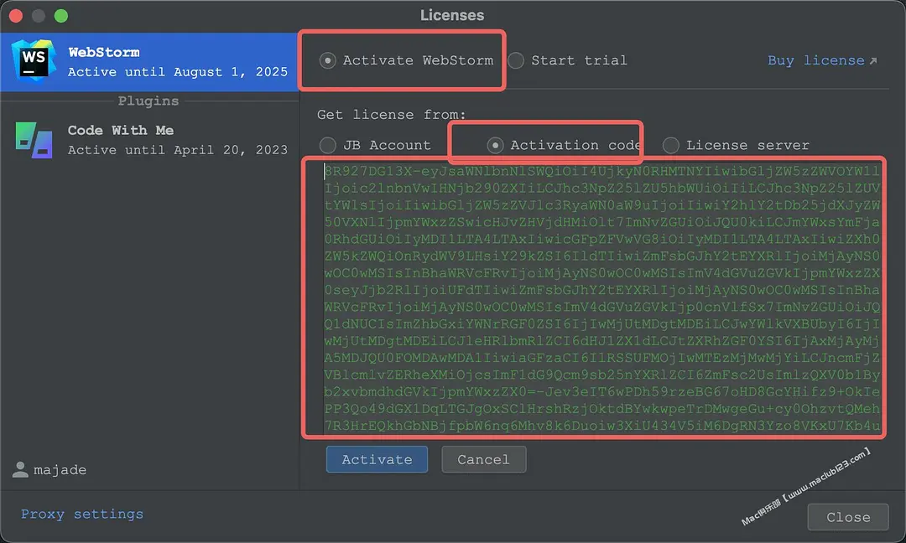
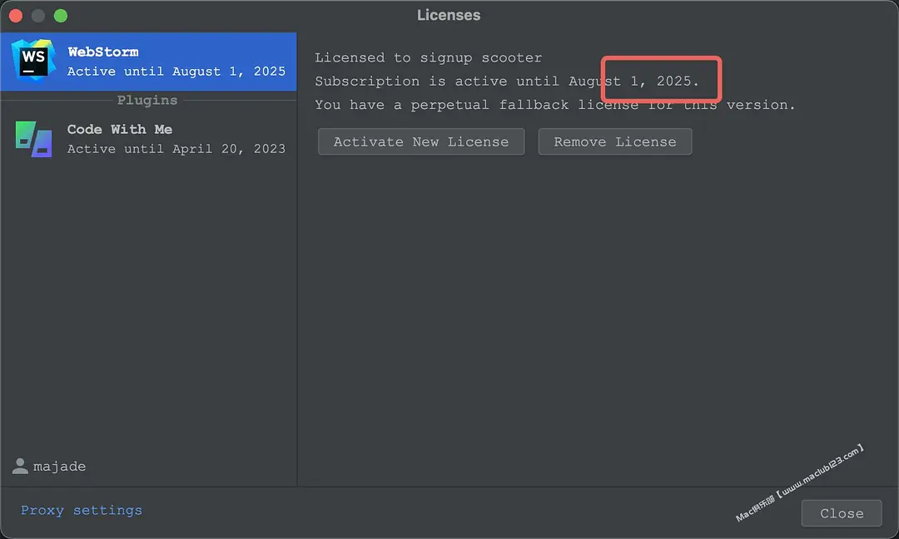

### Mac破解JetBrains相关软件
参考文中下载的是2023.1的，目前没有测试过，因为我拿不到它所说的破解软件压缩包

以下是我个人经验破解成功

### 下载软件
一定要下载2022.2.x版本的，其他版本没试过（因为破解文件有说明破解2022.2.x版本）

如：

安装然后打开

下载破解工具

·先把WebStorm关闭退出。

·打开下载好的激活包（下载后记得不要删掉，然后安装的路径尽量不要带中文路径、删掉就会失效的）

[破解工具地址](https://3.jetbra.in/)

打开随便点个地址进去

下载完如下：

软件激活

·先打开终端

·先运行uninstall.sh

·此步骤是一键帮你去掉以前所激活过留下的东西，解决key is invalid的问题。防止激活失败

·然后终端输入sh&nbsp;/Users/xxx/Downloads/jihuo-tool/scripts/uninstall.sh

·出现done说明成功。

·再执行install.sh，与上面同理，出现done，the kill xxxxx&nbsp;说明成功。

注意：script的目录不能存在中文，否则可能会出现错误。

然后关闭WebStrom，重新打开WebStrom，输入破解码激活即可

选择下面的选项，并输入激活码，点击Activate进行激活。

激活码从刚才那个网站中获取，哪个软件就用哪个的激活码

然后就成了，时间是假的，已经永久激活了。

### 参考
[WebStorm 2023.1 for Mac 永久破解](https://www.douban.com/note/847669214/?_i=2001126-pk_-U0)