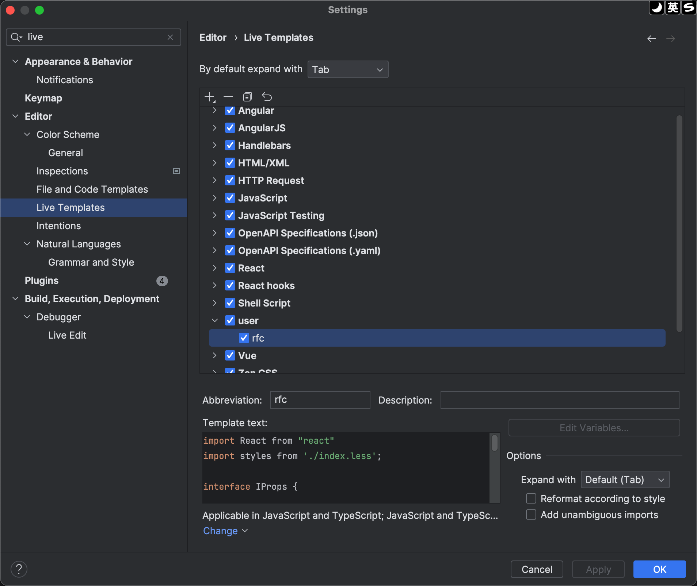
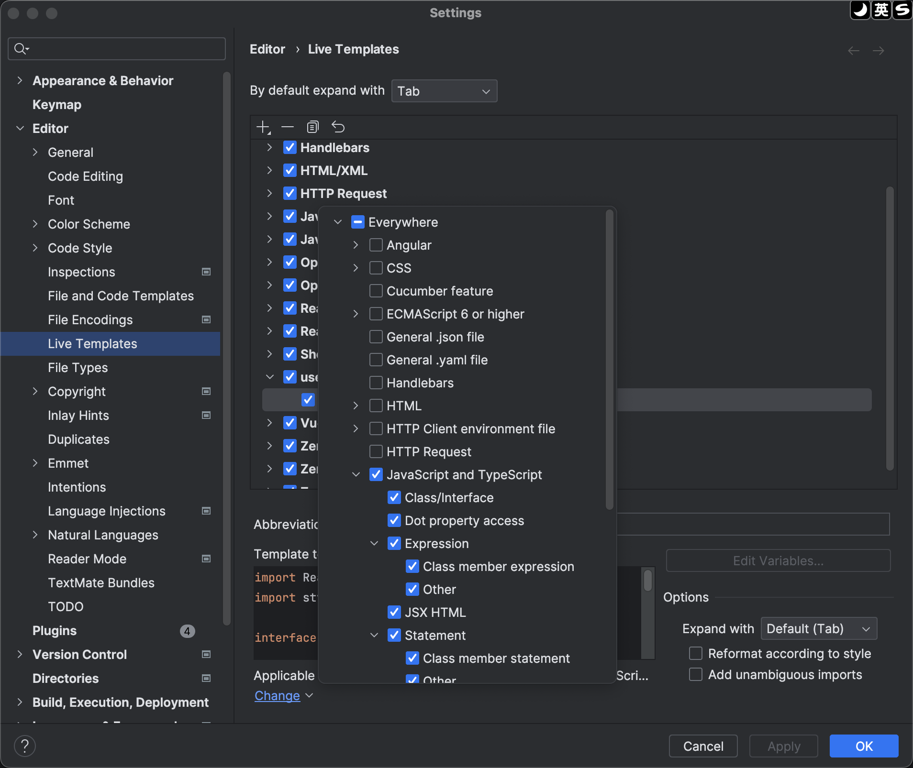

### 步骤
File → Setting → Live Templates → “ ＋ ” → 1.Live Templates → 填写内容 → Define → 选择语言 → APPLY → OK

设置语言

设置完成直接使用

### 参考

[JetBrains：webstrom中代码模板设置](https://blog.51cto.com/u_15349906/3716513)